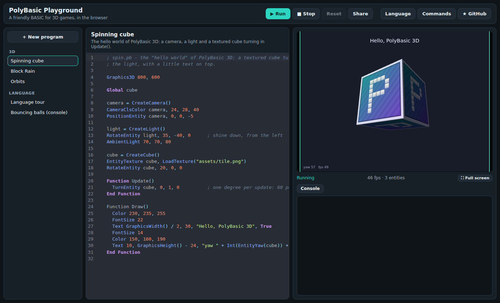
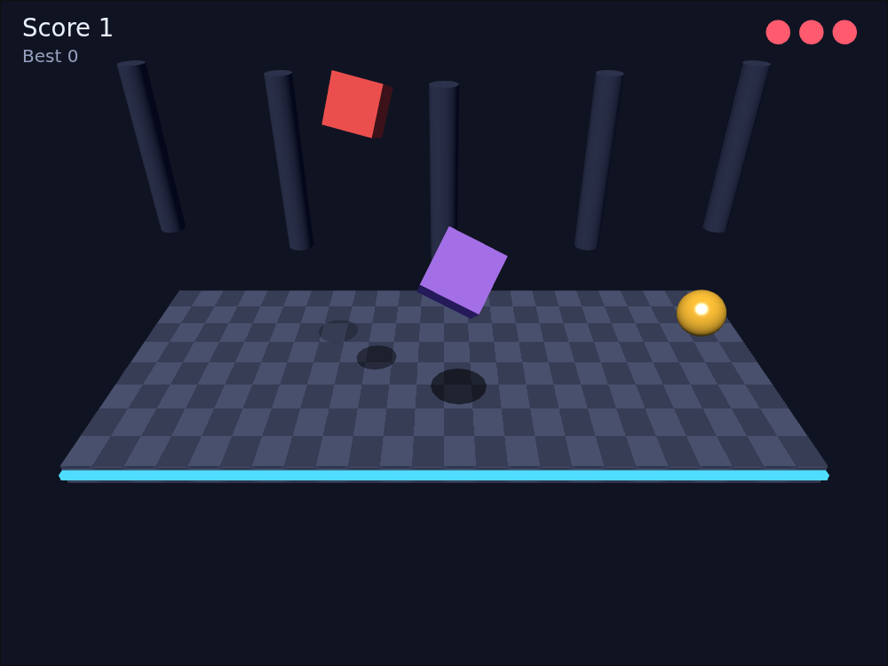
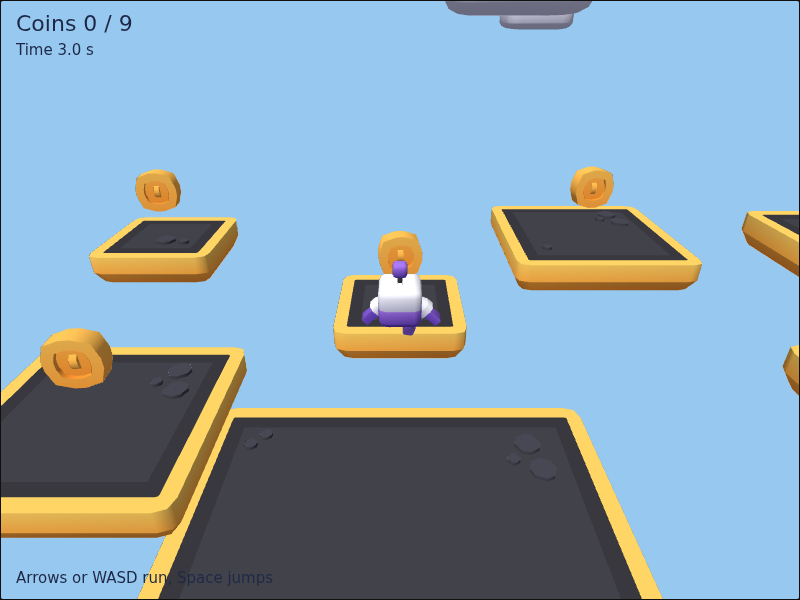

# PolyBasic

PolyBasic is a friendly BASIC for making 3D games in the browser. You write
short, readable programs in the spirit of Blitz Basic (type sigils, `Type`
objects, `For Each`, `CreateCube`, `TurnEntity`) and PolyBasic compiles them
to plain, fast JavaScript that runs on a WebGL canvas. glTF models with
their animations, picking with the mouse, collisions and physics are built
in ([docs/commands-3d.md](docs/commands-3d.md)).



```
; spin.pb
Graphics3D 800, 600

Global cube

camera = CreateCamera()
PositionEntity camera, 0, 0, -5
light = CreateLight()
RotateEntity light, 35, -40, 0

cube = CreateCube()
EntityTexture cube, LoadTexture("assets/tile.png")

; Update runs 60 times a second, after the setup above has run once.
Function Update()
  TurnEntity cube, 0, 1, 0
End Function

; Draw runs once per displayed frame, on top of the 3D picture.
Function Draw()
  Text 10, 10, "yaw " + Int(EntityYaw(cube))
End Function
```

## How programs run

The main part of a program runs once, as the setup. If the program has a
`Function Update()`, the host then calls it 60 times per second at a fixed
rate, and calls `Function Draw()` (if present) once per displayed frame.
`End` stops everything. A program without Update runs once and finishes,
which is how console programs and tests work.

Each frame the engine reads the keyboard and mouse before every Update,
moves the world on by one step after it (animations, physics, collisions),
draws the 3D scene, then runs Draw for the 2D layer. Files the main part
starts loading (models, textures) are in before the first Update. The program never
waits or blocks: the browser (or Node.js) owns the loop.
That is why there is no `Flip`, `Delay` or `WaitKey`, and why every compiled
function is ordinary synchronous JavaScript. The full story is in
[docs/language.md](docs/language.md#how-a-polybasic-program-runs).

## The playground

`web/index.html` is a small playground: a code editor with highlighting,
completion and live error marks, Run/Stop, the 3D screen, a console for
`Print` and errors (click an error to jump to its line), the examples, Share
links that carry the code in the URL, and full screen. Serve the repository
with any static server and open `/web/`:

```
python3 -m http.server 8080
# then open http://localhost:8080/web/
```

`web/player.html?src=../examples/block-rain.pb` runs one program full page.





## Using it from the command line

Requires Node.js 20 or newer. In Node the engine runs headless: the whole
scene exists and moves, nothing is drawn.

```
npm install
node bin/polybasic.mjs run examples/tour.pb          # console programs print here
node bin/polybasic.mjs run game.pb --frames 120      # stop after 120 updates
node bin/polybasic.mjs run game.pb --fake-time       # frames back to back, repeatable
node bin/polybasic.mjs build game.pb -o game.js      # write the JavaScript module
node bin/polybasic.mjs --js game.pb                  # print the generated JavaScript
```

From JavaScript (browser):

```js
import { compile, loadProgram, runProgram, BrowserHost, createScreen } from './dist/polybasic.js';

const screen = createScreen(document.getElementById('game'));
const { js } = compile(source, { file: 'game.pb' });
const result = await runProgram(await loadProgram(js), new BrowserHost({ output: console.log }), {
  engine: screen.newEngine({ baseUrl: 'games/game.pb' })
});
```

`compile` throws a `CompileError` with `file`, `line`, `column` and a plain
message. `runProgram` resolves with the program's status (`finished`,
`ended`, `stopped` or `error`, with the `.pb` line of a runtime error).

## Tests

```
npm test               # golden programs in tests/programs, unit tests in tests/unit
npm run test:browser   # Chromium: rendering, input, the playground (Playwright)
npm run lint           # ESLint (Allman braces)
npm run bench          # a few timings against hand-written JavaScript
npm run build          # dist/polybasic.js (compiler, runtime, engine, three.js) and dist/physics.js (Rapier)
```

Each `tests/programs/*.pb` is compiled and run on the headless engine, and
everything it prints (including compile errors, warnings and runtime errors)
is compared with `tests/expected/*.out`. After an intended change, `node
tests/run.mjs --update` rewrites the expected files; review the diff before
committing.

## Layout

```
bin/polybasic.mjs        command line
src/compiler/            lexer, parser, semantic pass, code generator
src/runtime/             runtime helpers, core commands, hosts, frame-loop runner
src/engine/math/         Vec3, Quat, Mat4, Aabb, Ray, Plane
src/engine/scene/        entities, the world, meshes, materials, textures
src/engine/collide/      picking and collisions: triangle trees, ray and sphere sweeps
src/engine/physics/      the physics commands and backend interface; rapier/ backend
src/engine/model/        the glTF reader, models and their animations
src/engine/render/       the render backend interface; three/ and null/ backends
src/engine/input/        keyboard and mouse, sampled per Update
src/engine/overlay/      the 2D layer for Draw
src/engine/commands.js   the 3D, 2D and input commands
src/node.js              Node glue: files from disk, physics on Rapier
dist/polybasic.js        the browser build (npm run build)
dist/physics.js          the physics engine for the browser, fetched only when used
web/                     the playground and the player page
examples/                example programs; assets/kenney has CC0 models by Kenney
docs/                    language.md, commands-3d.md
tests/                   golden programs, unit tests, browser tests, benchmark
```

## Roadmap

1. **Language and runtime**: the compiler to JavaScript, the core commands,
   Node and browser hosts, the Update/Draw frame model. Done.
2. **3D engine**: our own scene graph and maths, cameras, lights, shapes,
   textures, input and a 2D layer, with rendering behind a swappable backend
   (three.js first). A light playground. Done.
3. **Collisions, picking and physics** behind PolyBasic's own commands
   (Rapier first), and glTF models loaded into our own mesh data, with
   their node animations. Done.
4. **The full playground**: projects with files, export to a single page.
5. **Games**: more original example games written in PolyBasic.

## Licence

PolyBasic is released under the MIT licence (see [LICENSE](LICENSE)).
Parts of the compiler are derived from the Blitz3D compiler, (c) Blitz
Research Ltd, zlib licence. The browser build includes three.js (MIT), the
physics build Rapier (Apache-2.0) and the playground CodeMirror (MIT). The
models in `examples/assets/kenney` are by Kenney, CC0. See
[LICENSE-THIRD-PARTY](LICENSE-THIRD-PARTY).
