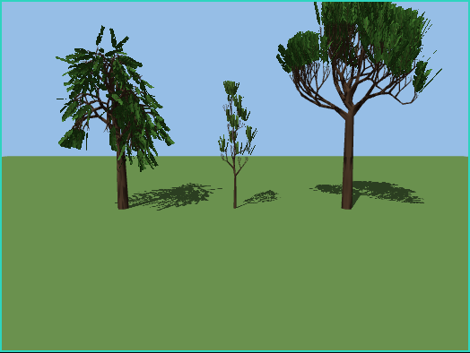
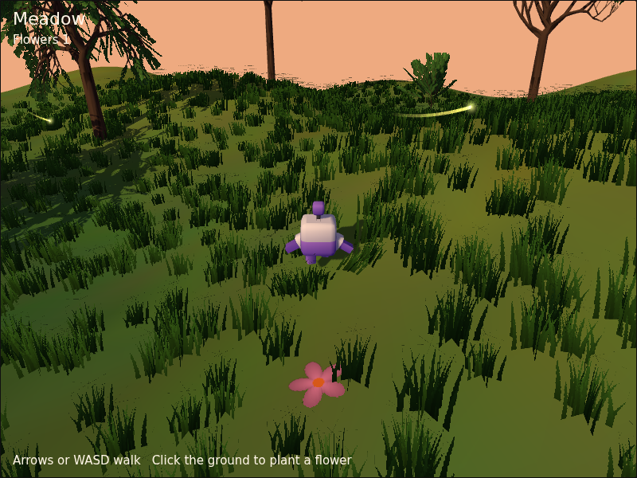
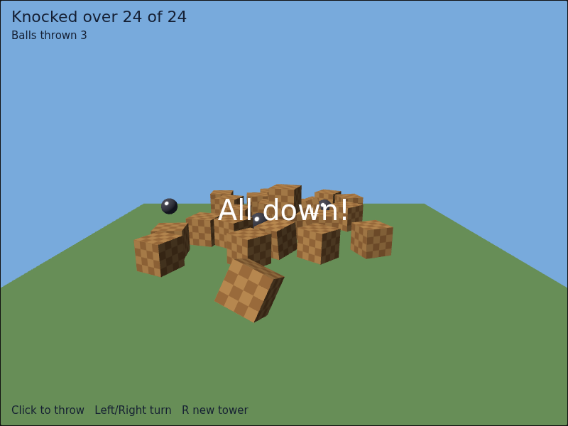
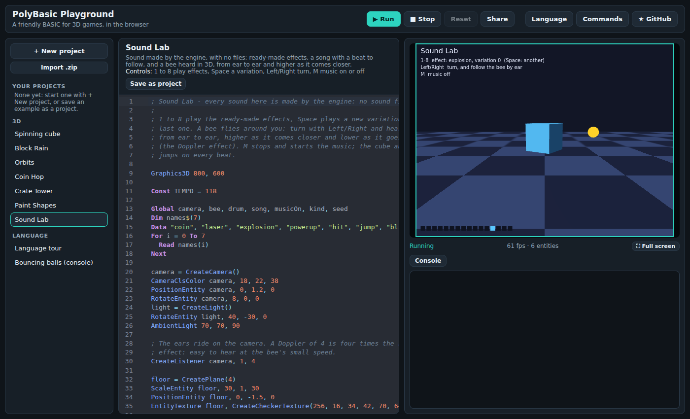

# PolyBasic 3D, 2D, sound and input commands

These commands come with the 3D engine. They work the same in the browser
(drawn with WebGL, heard through Web Audio) and in Node.js (a headless
engine that keeps the whole scene but draws and plays nothing, which is
what the tests use).

- [The basics](#the-basics)
- [Screen](#screen)
- [Cameras](#cameras)
- [Lights](#lights)
- [Shapes and pivots](#shapes-and-pivots)
- [Sprites](#sprites)
- [Trees](#trees)
- [Grass](#grass)
- [Ribbon trails](#ribbon-trails)
- [Building meshes](#building-meshes)
- [Looks](#looks)
- [Textures](#textures)
- [Moving and turning](#moving-and-turning)
- [Hierarchy and lifetime](#hierarchy-and-lifetime)
- [Models and animation](#models-and-animation)
- [Picking](#picking)
- [Collisions](#collisions)
- [Physics](#physics)
- [Sound](#sound)
- [Keyboard and mouse](#keyboard-and-mouse)
- [2D drawing](#2d-drawing)
- [Constants](#constants)
- [What happens in a frame](#what-happens-in-a-frame)

## The basics

**Entities.** Everything in the 3D world is an entity: cameras, lights,
shapes and pivots (invisible points that other entities can hang from).
The `Create...` commands return a **handle**, an Int such as `7`, that
you keep in a variable and pass to the other commands. Handles are never
reused within a run. `0` means "no entity" (for example "no parent").
Using a handle after `FreeEntity`, or passing a texture handle where an
entity is expected, stops the program with a clear runtime error.

**Space.** X points right, Y up and Z forward, into the screen. A new
camera sits at the origin looking along +Z, so things in front of it have a
positive Z. Distances have no fixed unit; the built-in shapes are 2 units
across (from -1 to 1), so think of one unit as half a metre.

**Angles** are in degrees:

| Angle | Axis | Positive means |
|-------|------|----------------|
| pitch | X    | the nose tilts down |
| yaw   | Y    | the entity turns left |
| roll  | Z    | the top tilts left |

They are applied roll first, then pitch, then yaw. `EntityPitch` is always
between -90 and 90.

**Local and global.** Every entity can have a parent. Its position,
rotation and scale are stored relative to the parent ("local"). Commands
that take an `isGlobal` flag work in world coordinates when it is `True`.

**Colours** are three Ints from 0 to 255 (red, green, blue).

## Screen

| Command | What it does |
|---------|--------------|
| `Graphics3D width, height` | Sets the screen size in pixels. The picture is scaled to fit the page, keeping this shape. Without it the screen is 800 x 600. |
| `GraphicsWidth%()` `GraphicsHeight%()` | The screen size. |
| `ClsColor r, g, b` | The background when there is no camera. |
| `FPS%()` | Frames drawn in the last second. |

## Cameras

| Command | What it does |
|---------|--------------|
| `CreateCamera%(parent = 0)` | A camera. Every camera draws the world; with several, they draw in order of `EntityOrder`, which with viewports gives split screens. |
| `CameraClsColor camera, r, g, b` | Background colour (default black). |
| `CameraRange camera, near#, far#` | Nearest and furthest distance drawn (default 0.1 and 1000). |
| `CameraFOV camera, degrees#` | Vertical field of view (default 60). |
| `CameraViewport camera, x, y, width, height` | Draw into this part of the screen only (pixels, from the top-left). |

## Lights

| Command | What it does |
|---------|--------------|
| `CreateLight%(kind = LIGHT_DIRECTIONAL, parent = 0)` | A directional light shines along its entity's forward axis, like the sun: turn it with `RotateEntity`. A point light (`LIGHT_POINT`) shines in every direction from where it is. |
| `LightColor light, r, g, b` | Colour and brightness (default white). |
| `LightRange light, range#` | How far a point light reaches (default 10). |
| `LightShadows light, on = True, area# = 40` | The light casts shadows (off by default). A directional light's shadows cover a square `area` units wide around what the camera looks at, moving with it: smaller is sharper, larger reaches further. A point light's reach as far as its `LightRange`. Every shape casts and receives shadows unless its `EntityFX` says otherwise. |
| `AmbientLight r, g, b` | Light that comes from everywhere, so unlit sides are not black (default 64, 64, 64). |

## Shapes and pivots

All shapes fit in the -1..1 cube and are centred on their entity. Shapes of
the same kind share their geometry, so a thousand cubes cost little.

| Command | Shape |
|---------|-------|
| `CreatePivot%(parent = 0)` | Nothing visible: a point to position, turn and hang other entities from. |
| `CreateCube%(parent = 0)` | A cube. |
| `CreateSphere%(segments = 16, parent = 0)` | A sphere; more segments look rounder. |
| `CreateCylinder%(segments = 16, solid = True, parent = 0)` | A cylinder along Y; `solid = False` leaves the ends open. |
| `CreateCone%(segments = 16, solid = True, parent = 0)` | A cone pointing up. |
| `CreatePlane%(divisions = 1, parent = 0)` | A flat square in X and Z, facing up. |
| `CreateTorus%(segments = 24, thickness# = 0.25, parent = 0)` | A ring lying flat. |

## Sprites

A sprite is a square, -1..1 across, that turns to face the camera: smoke,
sparks, flares, far-away trees. Sprites are lit by nothing (`FX_FULLBRIGHT`)
and cast no shadow, as in Blitz3D; `EntityFX` changes both.

| Command | What it does |
|---------|--------------|
| `CreateSprite%(parent = 0)` | A plain square (colour it with `EntityColor`, texture it with `EntityTexture`). |
| `LoadSprite%(file$, flags = TEX_COLOR, parent = 0)` | A sprite with an image. With `TEX_COLOR` it glows (it adds to what is behind, so black shows nothing): fire, sparks. With `TEX_ALPHA` it blends, with `TEX_MASKED` it is cut out. |
| `SpriteViewMode sprite, mode` | How it turns: 1 faces the camera (the default); 2 keeps the entity's own turn and is seen only from the front; 3 faces along the camera's view but keeps the entity's up; 4 stands upright and turns only with the camera's yaw (trees, posts). |
| `RotateSprite sprite, angle#` | Turns it in its own plane, anticlockwise, in degrees. |
| `ScaleSprite sprite, x#, y#` | Its width and height (1 is 2 units across). |
| `HandleSprite sprite, x#, y#` | The point it hangs from, -1..1 across and up the square: `HandleSprite s, 0, -1` puts its bottom edge at the entity's position. |

For picking, give a sprite `PICK_SPHERE` or `PICK_BOX`: rays do not know
which camera a sprite faces, so `PICK_POLYGON` sees its square turned as
the entity is.

## Trees



`CreateTree` grows a tree from numbers: a trunk that forks into branches,
with cards of leaves at their tips. The bark and the leaves are drawn by
code too, so no image file is needed. The trunk is the entity it returns;
the leaves are a child entity named `"twigs"`, with a masked texture, so
they cut their shape out of the light and cast leaf-shaped shadows.

| Command | What it does |
|---------|--------------|
| `CreateTree%(kind = TREE_OAK, seed = 0, parent = 0)` | A tree of one kind: `TREE_OAK`, `TREE_WILLOW`, `TREE_SHRUB`, `TREE_ASH`, `TREE_POPLAR`, `TREE_SEQUOIA` or `TREE_BEECH`, standing on its entity's position. Another `seed` grows a different tree of the same kind; the same seed always the same one. |

Retexture with `EntityTexture tree, bark` and
`EntityTexture FindChild(tree, "twigs"), leaves` (a leaf texture is best
`TEX_MASKED`: its black is left out). Growing a tree takes some tens of
milliseconds; for a forest, grow one of each kind and `CopyEntity` it:
copies share the meshes, so a hundred trees cost little more to keep than
one. Sizes, in units: a shrub is about 1 high, an oak 8, a willow 6, an ash
8, a poplar 13, a beech 10 and a sequoia 38; `ScaleEntity` to taste.

## Grass



A field of grass is many tufts, each three crossed cards of blades, drawn
all at once. The wind sways them, and things that walk through lean them
aside, without the program doing anything each step: the tufts are placed
once and the renderer bends them as it draws.

```
meadow = CreateGrass()
PaintGrass meadow, 0, 0, 20, 5000, ground     ; 5000 tufts on `ground`, 20 around
GrassPush meadow, player, 1                   ; the player parts the grass
```

| Command | What it does |
|---------|--------------|
| `CreateGrass%(parent = 0)` | An empty field. Its tufts are placed in the field entity's own space, so moving the entity moves the field. |
| `PaintGrass%(grass, x#, z#, radius#, count, onto = 0, size# = 1)` | Spreads `count` tufts evenly over a disc around x, z. With `onto` (an entity: a floor, a terrain, a model) each tuft stands where that entity's surface is below it, and none grows where there is none or where the ground is steeper than 60 degrees; without it they stand at the field's height 0. Returns how many were planted. |
| `PlantGrass grass, x#, y#, z#, size# = 1` | One tuft there. |
| `GrassSize grass, height#, width# = 0.6` | The size of a tuft (default 0.6 high); each tuft varies a little around it. |
| `GrassWind grass, strength#` | How much the wind sways it: 0 none, 1 a breeze (default), more a gale. |
| `GrassPush grass, entity, radius# = 1` | The grass within `radius` of the entity leans away from it (up to 8 entities; `GrassPush grass, 0` stops them all). |
| `ClearGrass grass` `CountGrass%(grass)` | Removes every tuft; how many there are. |

The blades are drawn by code (`EntityTexture` changes them: use a
`TEX_MASKED` texture with the blades at the top); `EntityColor` tints them.
Grass casts no shadow by default (`EntityFX` with no `FX_NOSHADOWCAST`
turns it on, at a cost, and that shadow does not sway), and shadows fall on
it. How many tufts a
computer draws smoothly depends on its graphics card: start with a few
thousand. (Measured in the test browser, which draws without a graphics
card, 2000 tufts ran at 12 frames a second; a graphics card was not
available to measure.)

## Ribbon trails

A trail is the ribbon a moving blade leaves behind it: a sword's swing, a
comet's tail, a jet's wake. The blade is two (or more) entities, often
pivots on the thing that moves; after every step the ribbon grows where
they went, smoothly between the points it samples, and fades with age.

```
hilt = CreatePivot(sword)
point = CreatePivot(sword)
PositionEntity point, 0, 2, 0
trail = CreateTrail(hilt, point)
TrailColor trail, 80, 200, 255
```

| Command | What it does |
|---------|--------------|
| `CreateTrail%(first, second)` | A trail between two entities (the blade's two ends). It glows (adds to what is behind), lit by nothing and seen from both sides; `EntityTexture` puts a texture along it (U across the blade, V along the way it went), `EntityBlend` changes how it mixes. |
| `TrailPoint trail, entity` | Adds a point to the blade (up to 8 in all), for a curved blade: the ribbon becomes a sheet through all of them. |
| `TrailLife trail, seconds#` | How long the ribbon lasts behind the blade (default 0.35). |
| `TrailStep trail, distance#` | How far the fastest point of the blade moves between samples (default 0.08 units): smaller follows fast turns more closely. |
| `TrailSmooth trail, pieces` | Straight pieces between two samples along the curve (default 12). |
| `TrailColor trail, r, g, b, alpha# = 1` | The colour at the head. |
| `TrailFadeColor trail, r, g, b, alpha# = 0` | The colour it fades to (default: the head's colour, fully faded). |
| `TrailEmit trail, on` | Stops (or starts again) growing; what is there fades away. |
| `ClearTrail trail` | Removes the ribbon at once. |

## Building meshes

A mesh is made of **surfaces**, and a surface of **vertices** (corners,
numbered from 0 as they are added) and **triangles** (three vertices each).
Build shapes of your own, or change any mesh, the built-in shapes and
model parts too: a shape shares its geometry with all the others of its
kind, so the first change gives it a copy of its own. `CopyEntity` of a
built (or already changed) mesh shares it with the copy, so changing one
changes both; `CopyMesh` always makes a separate one. Built meshes are drawn, picked, collide and take physics
bodies like any other.

A triangle is seen from the side where its corners run clockwise.

```
m = CreateMesh()
s = CreateSurface(m)
v0 = AddVertex(s, -1, 1, 0, 0, 0)     ; x, y, z, then the texture's u, v
v1 = AddVertex(s, 1, 1, 0, 1, 0)
v2 = AddVertex(s, 1, -1, 0, 1, 1)
v3 = AddVertex(s, -1, -1, 0, 0, 1)
AddTriangle s, v0, v1, v2
AddTriangle s, v0, v2, v3
UpdateNormals m                       ; work out how light falls on it
```

| Command | What it does |
|---------|--------------|
| `CreateMesh%(parent = 0)` | An empty mesh entity. |
| `CreateSurface%(mesh)` | A new, empty surface of the mesh. |
| `CountSurfaces%(mesh)` `GetSurface%(mesh, index)` | Its surfaces, numbered from 1. |
| `AddVertex%(surface, x#, y#, z#, u# = 0, v# = 0, w# = 1)` | Adds a corner; returns its number. (`w` is accepted for Blitz3D programs and not used.) |
| `AddTriangle%(surface, v0, v1, v2)` | Adds a triangle of three corners; returns its number. |
| `VertexCoords surface, index, x#, y#, z#` | Moves a corner. |
| `VertexNormal surface, index, nx#, ny#, nz#` | Sets the way a corner faces, for lighting. |
| `VertexColor surface, index, r#, g#, b#, a# = 1` | A corner's colour (0 to 255) and alpha (0 to 1), shown with `EntityFX` `FX_VERTEXCOLOR` (and the alpha with `FX_VERTEXALPHA`). |
| `VertexTexCoords surface, index, u#, v#, w# = 1, set = 0` | A corner's place on the texture. Only set 0 exists. |
| `CountVertices%(surface)` `CountTriangles%(surface)` | How many. |
| `VertexX#` `VertexY#` `VertexZ#` `VertexNX#` `VertexNY#` `VertexNZ#` `VertexU#` `VertexV#` `(surface, index)` | Read a corner back. |
| `VertexRed#` `VertexGreen#` `VertexBlue#` `VertexAlpha#` `(surface, index)` | Its colour. |
| `TriangleVertex%(surface, triangle, corner)` | The vertex at corner 0, 1 or 2 of a triangle. |
| `ClearSurface surface, vertices = True, triangles = True` | Empties it. |
| `UpdateNormals mesh` | Smooth lighting: each corner faces the average way of the triangles around it (corners at the same place share it). |
| `ScaleMesh mesh, x#, y#, z#` `RotateMesh mesh, pitch#, yaw#, roll#` `PositionMesh mesh, x#, y#, z#` | Changes the mesh itself (not the entity): every vertex moves. |
| `FitMesh mesh, x#, y#, z#, width#, height#, depth#, uniform = False` | Scales and moves the mesh to fill that box; `uniform` keeps its proportions. |
| `FlipMesh mesh` | Turns every triangle to face the other way. |
| `AddMesh source, dest` | Adds copies of `source`'s surfaces to `dest`. |
| `CopyMesh%(mesh, parent = 0)` | A new entity with a copy of the mesh (and its look). |
| `MeshWidth#(mesh)` `MeshHeight#(mesh)` `MeshDepth#(mesh)` | The size of the box around it. |

Changes are cheap: the mesh is rebuilt once, when it is next drawn or
used, however many vertices were added.

## Looks

| Command | What it does |
|---------|--------------|
| `EntityColor entity, r, g, b` | The surface colour (default white). |
| `EntityAlpha entity, alpha#` | 1 is solid, 0 invisible. |
| `EntityShininess entity, shininess#` | 0 matte to 1 very shiny. |
| `EntityFX entity, flags` | Add up `FX_FULLBRIGHT` (ignores lights, glows), `FX_VERTEXCOLOR` (uses the mesh's vertex colours), `FX_FLAT` (faceted shading), `FX_TWOSIDED` (draws the back of faces too), `FX_VERTEXALPHA` (the vertex colours' alpha blends), `FX_NOSHADOWCAST` (casts no shadow), `FX_NOSHADOWRECV` (shadows do not fall on it). |
| `EntityTexture entity, texture` | Wraps a texture around the shape; `0` removes it. The texture is tinted by the entity colour. |
| `EntityOrder entity, order` | Lower orders draw first (cameras too). |
| `EntityBlend entity, blend` | How it mixes with what is behind: 1 by its alpha (the default), 2 multiplies (darkens: shade, stains), 3 adds (glows: fire, light). |

Each entity has its own look: `CopyEntity` copies it, and changing the copy
leaves the original alone.

## Textures

| Command | What it does |
|---------|--------------|
| `LoadTexture%(file$, flags = TEX_COLOR)` | Starts loading a PNG or JPG and returns its handle at once. Nothing waits, but files started in the main body are in before the first `Update`. One loaded later shows the plain colour until its image arrives, usually a frame or two. The path is relative to the program's `.pb` file. A file that cannot be loaded is reported in the console. |
| `TextureLoaded%(texture)` | 1 once the image is in. |
| `CreateTexture%(width, height, r = 255, g = 255, b = 255, flags = TEX_COLOR)` | A texture filled with one colour, to paint on. |
| `CreateCheckerTexture%(size, cells, r1, g1, b1, r2 = 255, g2 = 255, b2 = 255)` | A square checkerboard of `cells` x `cells` squares. |
| `TexturePixel texture, x, y, r, g, b, a = 255` | Paints one pixel of a created texture; (0, 0) is the top-left. `a` is how solid it is (0 to 255), for textures with `TEX_ALPHA` or `TEX_MASKED`. |
| `ScaleTexture texture, u#, v#` | Repeats the texture `u` times across and `v` times down. |
| `FreeTexture texture` | Releases it. |

**Texture flags** are Blitz3D's, added up:

| Flag | Value | What it does |
|------|-------|--------------|
| `TEX_COLOR` | 1 | An ordinary texture (the default). |
| `TEX_ALPHA` | 2 | The image's alpha (or `TexturePixel`'s `a`) blends the texture with what is behind it: glass, smoke. |
| `TEX_MASKED` | 4 | Black pixels, and pixels less than half solid, are not drawn at all: leaves, fences, cut-out shapes. Their shadows are cut out too. |
| `TEX_MIPMAP` | 8 | Accepted; textures are always mipmapped here. |
| `TEX_CLAMPU` `TEX_CLAMPV` | 16 32 | The texture does not repeat across (U) or down (V): its edge pixels carry on. |

Flags 256 and 512 (video memory, high colour) are accepted and mean
nothing here; sphere and cube maps (64, 128) are not supported.

## Moving and turning

| Command | What it does |
|---------|--------------|
| `PositionEntity entity, x#, y#, z#, isGlobal = False` | Puts the entity at a position. |
| `MoveEntity entity, x#, y#, z#` | Moves along the entity's own axes: `MoveEntity ship, 0, 0, 1` is one step forward, wherever the ship faces. |
| `TranslateEntity entity, x#, y#, z#, isGlobal = False` | Moves along the parent's axes (or the world's), ignoring the entity's own rotation. |
| `RotateEntity entity, pitch#, yaw#, roll#, isGlobal = False` | Sets the rotation. |
| `TurnEntity entity, pitch#, yaw#, roll#, isGlobal = False` | Turns by these angles, about the entity's own axes (or the world axes). |
| `PointEntity entity, target, roll# = 0` | Turns the entity so it faces another one. |
| `ScaleEntity entity, x#, y#, z#` | Stretches the entity (and its children). Scale is always relative to the parent. |
| `EntityX#(entity, isGlobal = False)`, `EntityY#`, `EntityZ#` | Position. |
| `EntityPitch#(entity, isGlobal = False)`, `EntityYaw#`, `EntityRoll#` | Rotation. |
| `EntityDistance#(entity, other)` | Distance between two entities in the world. |

## Hierarchy and lifetime

| Command | What it does |
|---------|--------------|
| `EntityParent entity, parent, isGlobal = True` | Attaches the entity to a parent (`0` detaches it). With `isGlobal` it stays where it is on screen; with `False` it keeps its local values and so moves with the new parent. |
| `GetParent%(entity)` | The parent, or 0. |
| `CountChildren%(entity)` `GetChild%(entity, index)` | The children, numbered from 1. |
| `HideEntity entity` `ShowEntity entity` `EntityHidden%(entity)` | Hidden entities (and their children) are not drawn, but still move and exist. |
| `FreeEntity entity` | Removes the entity and all its children. |
| `CopyEntity%(entity, parent = 0)` | A copy, with copies of its children. |
| `EntityExists%(entity)` | 1 if the handle is a live entity. |
| `NameEntity entity, name$` `EntityName$(entity)` | A name, for your own bookkeeping. |

## Models and animation

Models are glTF 2.0 files, `.gltf` or `.glb` (the format most free 3D
models come in; Blender, for example, exports it). The Kenney models in
`examples/assets/kenney` (CC0) are ready to use.

| Command | What it does |
|---------|--------------|
| `LoadMesh%(file$, parent = 0)` | Starts loading a model and returns its handle at once: a pivot the model's parts will hang from. Models loaded in the main body are in before the first `Update`. The path is relative to the program's `.pb` file. A file that cannot be loaded is reported in the console. |
| `MeshLoaded%(entity)` | 1 once the model is in. |
| `FindChild%(entity, name$)` | A part of the model (any entity below it) by its name in the file, not case-sensitive; 0 if there is none. `EntityName$` gives a part's name. |
| `CountAnimations%(entity)` `AnimationName$(entity, index)` | The model's animations, numbered from 1. |
| `FindAnimation%(entity, name$)` | An animation's number by its name (not case-sensitive), 0 if there is none. |
| `Animate entity, animation = 1, mode = ANIM_LOOP, speed# = 1` | Plays an animation: `ANIM_LOOP` over and over, `ANIM_ONCE` to the end and stop there, `ANIM_PINGPONG` forwards and back. A negative speed plays it backwards; `Animate entity, 0` stops. |
| `Animating%(entity)` | 1 while an animation plays (0 once `ANIM_ONCE` reached the end). |
| `AnimTime#(entity)` `SetAnimTime entity, time#` | Where the animation is, in seconds; setting it shows that moment. |
| `AnimLength#(entity, animation = 1)` | How long an animation is, in seconds. |

**Parts.** Every node of the file becomes an entity below the model's pivot,
with the node's name, so the usual commands work on the parts: `EntityColor
FindChild(robot, "arm-left"), 255, 0, 0`. Move, turn and scale the model
through its pivot.

**Setting up in the main body.** A model's parts only exist once it has
arrived: in the main body `CountChildren` is still 0, `FindChild` finds
nothing and `CountAnimations` and the like report that the model is still
loading; from the first `Update` on, everything is there. The commands that need the parts to do their job wait
for the model instead, and run as soon as it is in, in the order they were
given: `CopyEntity` (the copy gets its own parts), `EntityBody` (and the
`Body...`, `Apply...` and `Set...Velocity` commands that follow it) and
`Animate`. So a program can load, copy, give bodies and start animations
all in its main body.

**What is read.** Meshes with their normals, texture coordinates and vertex
colours; materials (base colour and texture, transparency, double-sided,
unlit, texture transforms); textures in separate PNG/JPG files or inside the
`.glb`; the node tree; node animations (moving, turning and scaling parts,
which is how the Kenney character walks). Not read yet: skinned meshes
(bones) and morph targets, which show in their rest pose with a note in the
console, cameras and lights in the file, and compressed files (Draco,
meshopt, Basis textures), which are reported as errors.

**Space.** glTF is right-handed, PolyBasic left-handed. Models are mirrored
across X as they load, so a model's front is along +Z (forward, like any
entity) and its left side is on your left: turn a model 180 degrees to face
a camera that looks at it along +Z.

**Copies.** `CopyEntity` of a model shares its mesh data and file, so a
hundred coins cost little; each copy has its own parts, looks and animation.

## Picking

Picking finds what is on a line: what the mouse points at, what a gun
would hit, whether one thing can see another. Only entities with a pick
mode are found, and hidden entities never are.

| Command | What it does |
|---------|--------------|
| `EntityPickMode entity, mode, obscurer = True` | How the entity is picked: `PICK_SPHERE` (a sphere of its `EntityRadius`), `PICK_BOX` (its `EntityBox`, or the box around its mesh), `PICK_POLYGON` (its exact triangles, both sides) or `PICK_NONE`. `obscurer = False` keeps it out of `EntityVisible`. For a model, the mode covers all its parts and a pick names the model. |
| `EntityRadius entity, x#, y# = 0` | The sphere for `PICK_SPHERE`, and the ellipsoid for collisions: `x` wide (X and Z), `y` high; `y = 0` makes it a sphere. In world units, not changed by scale. Default 1. |
| `EntityBox entity, x#, y#, z#, width#, height#, depth#` | The box for `PICK_BOX` (and `COLLIDE_BOX`), in the entity's own space (so it turns and scales with it). Default: the box around its mesh, or -1..1. |
| `CameraPick%(camera, x#, y#)` | The entity at screen pixel (x, y) as the camera sees it (`MouseX()`, `MouseY()` for the pointer), or 0. |
| `LinePick%(x#, y#, z#, dx#, dy#, dz#, radius# = 0)` | The first entity on the line from (x, y, z) to (x + dx, y + dy, z + dz), or 0. With a radius, the first thing a ball of that size moving along the line would touch. |
| `EntityPick%(entity, range#)` | The first entity straight ahead of an entity (along its +Z), up to `range` away. The entity itself is left out. |
| `EntityVisible%(entity, other)` | 1 if nothing that is an obscurer is on the straight line between the two. |
| `PickedEntity%()` | What the last pick found, or 0. |
| `PickedX#()` `PickedY#()` `PickedZ#()` | Where it was hit (for a line with a radius: where the ball touched). |
| `PickedNX#()` `PickedNY#()` `PickedNZ#()` | The surface's direction there, facing back along the line. |
| `PickedTime#()` `PickedDistance#()` | How far along the line (0 to 1), and the distance from its start. |
| `CameraProject%(camera, x#, y#, z#)` | Puts a world point on the screen: 1 if it is in front of the camera, and then `ProjectedX#()` and `ProjectedY#()` are its pixel, `ProjectedZ#()` its distance in front. For labels over 3D things in `Draw`. |
| `CreateDecal%(texture, x#, y#, z#, nx#, ny#, nz#, size#, angle# = 0, entity = 0)` | Presses a square of `texture` (0 for none: colour it with `EntityColor`) `size` wide onto the surfaces at x, y, z, which face the way nx, ny, nz: a scorch mark, a bullet hole, a footprint. Use it after a pick: `CreateDecal(tex, PickedX(), PickedY(), PickedZ(), PickedNX(), PickedNY(), PickedNZ(), 0.5)`. `angle` turns it, anticlockwise. It is cut to the shapes it lies on (surfaces facing another way are left out), sits just over them without flickering, and is lit as they are. With `entity` it goes on that entity only and moves with it; otherwise on every shown mesh there, where it stays. It is an ordinary mesh entity: `EntityAlpha`, `EntityBlend`, `FreeEntity` work on it. |

## Collisions

Collisions stop things from moving through each other. You give entities a
collision type (a number you choose, such as 1 for the player and 2 for
walls) and say which types meet which, and how. After every `Update`, each
entity that moved is swept from where it was to where the program put it,
as an ellipsoid of its `EntityRadius`; if it would pass through something
of a type it meets, it stops there or slides along it. Fast things do not
pass through thin walls.

| Command | What it does |
|---------|--------------|
| `EntityType entity, type` | The entity's collision type, 1 to 999 (0: none). |
| `GetEntityType%(entity)` | Its type. |
| `Collisions srcType, dstType, method, response` | Entities of `srcType` that move are stopped by those of `dstType`. The method is what they meet: `COLLIDE_SPHERE` (the other's `EntityRadius` sphere), `COLLIDE_POLYGON` (its mesh triangles, or a model's), `COLLIDE_BOX` (its `EntityBox`, from the outside). The response: `RESPONSE_STOP`, `RESPONSE_SLIDE` (slide along what was hit), or `RESPONSE_SLIDE_NO_DOWNHILL` (slide, but a floor or ramp does not turn a fall into sliding, so a character does not slip down slopes under gravity). |
| `ClearCollisions` | Forgets all the `Collisions` rules. |
| `ResetEntity entity` | Makes the entity's next move a jump: after `PositionEntity` to teleport it, so it is not swept all the way there. |
| `CountCollisions%(entity)` | How many things it ran into in the last step. |
| `CollisionEntity%(entity, index)` | The entity it ran into (numbered from 1). |
| `CollisionX#(entity, index)` `CollisionY#` `CollisionZ#` | Where they touched. |
| `CollisionNX#(entity, index)` `CollisionNY#` `CollisionNZ#` | The surface's direction there: `CollisionNY > 0.6` means it stands on a floor. |
| `EntityCollided%(entity, type)` | The first entity of that type it ran into in the last step, or 0. |

The ellipsoid is always upright (it does not turn with the entity) and
centred on the entity's position: for a character standing on its feet,
make a pivot the ellipsoid and hang the model below it (see
`examples/coin-hop.pb`). With `COLLIDE_SPHERE` the moving entity is a sphere
of its `x` radius. The things it meets are taken where they are: only the
entity that moved is swept.

Collisions happen after `Update`, so what an `Update` reads (positions,
`CountCollisions`...) is the result of the moves made in the previous one.
Positions set in the main body are jumps, not moves.

## Physics



Physics makes things fall, tumble, bounce and push each other, with the
Rapier physics engine underneath. You give entities a body; after every
`Update` the physics world advances by one step of 1/60 s and moves the
entities with dynamic bodies. A program that uses a physics command waits,
before its main body runs, for the physics engine to load (in the browser
a separate file, only fetched by programs that need it).

| Command | What it does |
|---------|--------------|
| `EntityBody entity, kind = BODY_DYNAMIC, shape = SHAPE_AUTO` | Gives the entity a body. `BODY_DYNAMIC` moves by physics; `BODY_STATIC` never moves (floors, walls); `BODY_KINEMATIC` is moved by the program and pushes dynamic bodies out of its way (lifts, paddles). |
| `FreeBody entity` `EntityHasBody%(entity)` | Removes the body (the entity stays); is there one? |
| `PhysicsGravity x#, y#, z#` | Gravity, in units per second per second. Default 0, -19.6, 0: 9.8 m/s² with one unit as half a metre. |
| `BodyMass entity, mass#` | Default 1 for every dynamic body, whatever its size. |
| `BodyFriction entity, friction#` | 0 is ice; default 0.5. |
| `BodyBounce entity, bounce#` | 0 does not bounce (default), 1 bounces back as high. |
| `BodyDamping entity, linear#, angular#` | Air resistance for moving and turning (default 0 and 0.05). |
| `BodyLockRotation entity, pitch, yaw, roll` | `True` stops all turning about that world axis (pitch: X, yaw: Y, roll: Z). A thing that must stay upright locks pitch and roll; a character steered by the program, all three. |
| `ApplyImpulse entity, x#, y#, z#` | A sudden push (a kick, a jump): the velocity changes by it divided by the mass. |
| `ApplyForce entity, x#, y#, z#` | A push during the next step only (an engine: call it every `Update`). |
| `ApplyTorque entity, pitch#, yaw#, roll#` | A twist during the next step only. |
| `SetVelocity entity, x#, y#, z#` | Sets the velocity, in units per second. |
| `SetAngularVelocity entity, pitch#, yaw#, roll#` | Sets the turning speed, in degrees per second about the world axes, with the same signs as `TurnEntity`. |
| `BodyVX#(entity)` `BodyVY#` `BodyVZ#` | The velocity. |
| `BodyPitchSpeed#(entity)` `BodyYawSpeed#` `BodyRollSpeed#` | The turning speed, in degrees per second. |
| `CountContacts%(entity)` `ContactEntity%(entity, index)` | The bodies it touches, numbered from 1. |

**Shapes.** A body's shape is worked out when `EntityBody` is called, from
the entity's mesh (for a model, all its parts), `EntityBox` or `EntityRadius`
and its scale at that moment:

| Shape | What it is |
|-------|------------|
| `SHAPE_AUTO` | The default: a sphere or a cylinder for those built-in shapes; the exact triangles for a static or kinematic body; a box around a dynamic one; for a pivot with nothing below it, a sphere of its `EntityRadius`. |
| `SHAPE_BOX` `SHAPE_SPHERE` `SHAPE_CAPSULE` `SHAPE_CYLINDER` | That shape around the mesh (capsules and cylinders stand along Y). |
| `SHAPE_HULL` | The tightest convex shape around the mesh's points (convex: no hollows). |
| `SHAPE_MESH` | The exact triangles: only for static and kinematic bodies. |

**Moving bodies by hand.** `PositionEntity`, `TurnEntity` and the rest
still work: on a dynamic or static body it is a jump, on a kinematic one a
move that pushes. Bodies of children follow their place in the world.
`CopyEntity` does not copy bodies.

Physics and collisions are separate: use collisions for characters you
steer and physics for things that should tumble; an entity should have one
or the other.

## Sound



Sounds come from files (WAV, OGG or MP3: `LoadSound`) or are made by the
engine from a recipe, with no file at all (`CreateSfx`, `CreateTone`).
`PlaySound` plays one on a new **channel**, a number the program can use
to change or stop that playing copy. Music is either a file (`PlayMusic`)
or a **song** written as lines of notes (`CreateSong`, `SongTrack`). Sounds
can also be placed in the 3D world (`CreateListener`, `EmitSound`): they
fade with distance, come from the left or the right, and rise and fall in
pitch as they pass (the Doppler effect).

| Command | What it does |
|---------|--------------|
| `LoadSound%(file$)` | Starts loading a sound file and returns its handle at once. Files started in the main body are in by the first `Update`. |
| `Load3DSound%(file$)` | The same as `LoadSound` (any sound can be placed in the world); kept for Blitz3D programs. |
| `SoundLoaded%(sound)` | 1 once the file is in (always 1 for made sounds). A missing file, or one that is not a sound, is reported and never loads. |
| `FreeSound sound` | Stops its channels and lets it go. |
| `LoopSound sound` | From now on `PlaySound` plays it over and over, until `StopChannel`. |
| `SoundVolume sound, volume#` | How loud `PlaySound` plays it: 1 as recorded (default), 0 silent. |
| `SoundPitch sound, hz` | The rate `PlaySound` plays it at, in samples a second: twice the rate it was recorded at is an octave up and twice as fast. 0: as recorded (default). Made sounds are 44100 Hz, a WAV file the rate in the file; OGG and MP3 files count as 44100 Hz. |
| `SoundPan sound, pan#` | -1 left, 0 middle (default), 1 right. |
| `PlaySound%(sound)` | Plays it as set up above, on a new channel; returns the channel. |
| `CreateSfx%(kind, seed = 0)` | A ready-made effect: `SFX_COIN`, `SFX_LASER`, `SFX_EXPLOSION`, `SFX_POWERUP`, `SFX_HIT`, `SFX_JUMP`, `SFX_BLIP` or `SFX_RANDOM`. Another `seed` gives a variation. The same kind and seed give the same sound (the same handle), so asking for it again is cheap. |
| `CreateTone%(wave, freq#, freqEnd#, ms, volume# = 0.5)` | A tone of `ms` milliseconds sliding from `freq` to `freqEnd` Hz, in one of the waves `WAVE_SQUARE`, `WAVE_TRIANGLE`, `WAVE_SAW`, `WAVE_SINE`, `WAVE_NOISE`. |

**Channels.** A finished channel is simply not playing any more: the
commands below do nothing to it (and `ChannelPlaying` gives 0). A number
that no `PlaySound`, `EmitSound` or `PlayMusic` gave is an error.

| Command | What it does |
|---------|--------------|
| `StopChannel channel` | Stops it for good. |
| `PauseChannel channel` `ResumeChannel channel` | Holds it where it is, and goes on from there. |
| `ChannelVolume channel, volume#` `ChannelPan channel, pan#` | As `SoundVolume` and `SoundPan`, for this playing copy only. (A sound placed in the world takes its pan from where it is.) |
| `ChannelPitch channel, hz` | As `SoundPitch`, for this playing copy only (not for music files). |
| `ChannelPlaying%(channel)` | 1 while it is playing, or paused part way. |

**Music.**

| Command | What it does |
|---------|--------------|
| `PlayMusic%(file$, loop = True)` | Plays a music file (WAV, OGG or MP3) on a channel of its own, decoded bit by bit as it plays rather than all at once; it loops unless `loop` is `False`. The channel works with the commands above (except `ChannelPitch`). |
| `EffectsVolume volume#` | Volume of all sounds, 0 to 1 (default 1). |
| `MusicVolume volume#` | Volume of the music: `PlayMusic` and songs, 0 to 1 (default 1). |

**Songs.** A song has a tempo and tracks. A track is an instrument and a
line of notes, one step per sixteenth note (four steps a beat); shorter
tracks repeat under the longest one.

| Command | What it does |
|---------|--------------|
| `CreateSong%(bpm)` | A new, empty song at `bpm` beats a minute (20 to 400). |
| `SongTrack%(song, instrument, notes$, volume# = 0.6)` | Adds a track and returns how many the song has. Instruments: `INST_SQUARE`, `INST_TRIANGLE`, `INST_SAW`, `INST_SINE`, `INST_PLUCK` (short, plucked), `INST_PAD` (soft, slow), `INST_BASS` (an octave down), `INST_DRUMS`. |
| `PlaySong song, loop = True` | Plays it (stopping the song playing), over and over unless `loop` is `False`. |
| `StopSong` | Stops the song. |
| `SongPlaying%()` | The song playing (or waiting for the player's first click), 0 for none. |
| `SongTime#()` | Seconds of the song heard so far, through every loop, read from the sound's own clock: follow the beat with this, not with frames. 0 while it waits for the first click. |
| `SongStep%()` | The step being heard, from 0 to the song's length - 1: `SongStep() / 4` is the beat. -1 with no song. |

A line of notes is made of tokens separated by spaces (or `|`, to mark
bars): a note is its name, an optional `#` or `b` and the octave (`C4`,
`F#3`, `Bb2`; `A4` is 440 Hz); `-` holds the note before one more step;
`.` is a step of silence. Drum tracks use `k` (kick), `s` (snare) and `h`
(hi-hat), alone or together (`kh`). Anything else is an error that names
the token.

```
song = CreateSong(120)
SongTrack song, INST_PLUCK, "C4 E4 G4 E4 | C4 E4 G4 C5"
SongTrack song, INST_BASS,  "C3 - - - | G2 - - -"
SongTrack song, INST_DRUMS, "k . h . s . h ."
PlaySong song
```

**Sound in the 3D world.**

| Command | What it does |
|---------|--------------|
| `CreateListener%(parent, rolloff# = 1, doppler# = 1, distance# = 0.5)` | The ears: a pivot, usually put on the camera (`CreateListener(camera)`). `rolloff` is how fast sounds fade with distance (0: they do not), `doppler` how strong the Doppler effect is (0: none, 1: real), `distance` how many metres one unit is (0.5, as for physics). A new listener replaces the one before. |
| `EmitSound%(sound, entity)` | Plays a sound where the entity is, and keeps it there as the entity moves (after it is freed, the sound stays where it was). Returns the channel. |

A sound in the world is as loud as `SoundVolume` / `ChannelVolume` within a
metre of the listener, and beyond that fades as 1 / distance (with
`rolloff` 1; a larger `rolloff` fades it faster). It comes from the
side of the listener it is on, and its pitch rises while it comes closer
and falls while it goes away, by the speed of sound (343 m/s).

**When sound can start.** Browsers only let a page make sound once the
player has clicked, touched or pressed a key on it (clicking Run in the
playground counts). Until then `PlaySound` and `EmitSound` are skipped
(they still return a channel, which is not playing), while `PlayMusic` and
songs wait and start by themselves. A hidden page is silent, and goes on
where it was when it is shown again. When the program stops, so does every
sound, so a program that plays sounds needs an `Update` to keep running.

**Headless.** In Node.js nothing is heard, but a channel plays for as long
as its sound lasts (at its pitch), on the clock of the updates, and songs
keep their tempo: programs that wait for a sound, or follow a song's beat,
run the same. The length of a WAV file is read from it; OGG and MP3 files
cannot be measured there and play for no time.

## Keyboard and mouse

Input is read once at the start of every Update, so all the Updates of a
game see a consistent picture, and a key press is reported by `KeyHit` in
exactly one Update, however the frames fall.

| Command | What it does |
|---------|--------------|
| `KeyDown%(key)` | 1 while the key is held. A tap shorter than one Update still counts. |
| `KeyHit%(key)` | How many times the key was pressed since the last Update (usually 0 or 1). Holding a key does not repeat. |
| `KeyUp%(key)` | 1 in the Update after the key was released. |
| `MouseX%()` `MouseY%()` | Pointer position in screen pixels (Graphics3D coordinates). |
| `MouseDown%(button = MOUSE_LEFT)` | 1 while the button is held. |
| `MouseHit%(button = MOUSE_LEFT)` | Presses since the last Update. |
| `MouseXSpeed%()` `MouseYSpeed%()` | How far the pointer moved since the last Update. |
| `MouseWheel%()` | Wheel steps since the last Update (positive = away from you). |
| `LockPointer on = True` | Hides the pointer and keeps it in the game on the next click, for mouse-look; `MouseXSpeed` and `MouseYSpeed` keep working. `LockPointer False` releases it. |

On a touch screen the first finger is the mouse: touching is
`MouseDown(MOUSE_LEFT)`, and dragging moves `MouseX`/`MouseY`.

Keys typed into a text box on the same page (such as the playground's
editor) are not game input.

## 2D drawing

Draw these in `Draw()`. They go on a transparent layer over the 3D picture,
which is cleared before every `Draw`. Coordinates are screen pixels from
the top-left; text stays sharp at any page size.

| Command | What it does |
|---------|--------------|
| `Color r, g, b` | Colour for the next shapes and text (default white). It stays until changed. |
| `FontSize size` | Text height in pixels (default 16). |
| `Text x, y, text$, centerX = False, centerY = False` | Writes text with its top-left at (x, y), or centred on it. |
| `TextWidth%(text$)` | Width of a text at the current size. |
| `Rect x, y, width, height, solid = True` | A rectangle, filled or outlined. |
| `Oval x, y, width, height, solid = True` | An ellipse inside that rectangle. |
| `Line x1, y1, x2, y2` | A line. |
| `Plot x, y` | One pixel. |

## Constants

| Name | Value |
|------|-------|
| `KEY_A` ... `KEY_Z` | 65 ... 90 |
| `KEY_0` ... `KEY_9` | 48 ... 57 |
| `KEY_LEFT` `KEY_UP` `KEY_RIGHT` `KEY_DOWN` | 37 38 39 40 |
| `KEY_SPACE` `KEY_ENTER` `KEY_ESCAPE` `KEY_TAB` `KEY_BACKSPACE` | 32 13 27 9 8 |
| `KEY_SHIFT` `KEY_CONTROL` `KEY_ALT` | 16 17 18 (either side) |
| `KEY_F1` ... `KEY_F12` | 112 ... 123 |
| `MOUSE_LEFT` `MOUSE_RIGHT` `MOUSE_MIDDLE` | 1 2 3 |
| `LIGHT_DIRECTIONAL` `LIGHT_POINT` | 1 2 |
| `FX_FULLBRIGHT` `FX_VERTEXCOLOR` `FX_FLAT` `FX_TWOSIDED` `FX_VERTEXALPHA` | 1 2 4 16 32 |
| `FX_NOSHADOWCAST` `FX_NOSHADOWRECV` | 131072 262144 |
| `TEX_COLOR` `TEX_ALPHA` `TEX_MASKED` `TEX_MIPMAP` `TEX_CLAMPU` `TEX_CLAMPV` | 1 2 4 8 16 32 |
| `TREE_OAK` `TREE_WILLOW` `TREE_SHRUB` `TREE_ASH` `TREE_POPLAR` `TREE_SEQUOIA` `TREE_BEECH` | 1 to 7 |
| `PICK_NONE` `PICK_SPHERE` `PICK_POLYGON` `PICK_BOX` | 0 1 2 3 |
| `COLLIDE_SPHERE` `COLLIDE_POLYGON` `COLLIDE_BOX` | 1 2 3 |
| `RESPONSE_STOP` `RESPONSE_SLIDE` `RESPONSE_SLIDE_NO_DOWNHILL` | 1 2 3 |
| `BODY_STATIC` `BODY_DYNAMIC` `BODY_KINEMATIC` | 1 2 3 |
| `SHAPE_AUTO` `SHAPE_BOX` `SHAPE_SPHERE` `SHAPE_CAPSULE` `SHAPE_CYLINDER` `SHAPE_HULL` `SHAPE_MESH` | 0 to 6 |
| `ANIM_STOP` `ANIM_LOOP` `ANIM_ONCE` `ANIM_PINGPONG` | 0 1 2 3 |
| `SFX_COIN` `SFX_LASER` `SFX_EXPLOSION` `SFX_POWERUP` `SFX_HIT` `SFX_JUMP` `SFX_BLIP` `SFX_RANDOM` | 0 to 7 |
| `WAVE_SQUARE` `WAVE_TRIANGLE` `WAVE_SAW` `WAVE_SINE` `WAVE_NOISE` | 0 to 4 |
| `INST_SQUARE` `INST_TRIANGLE` `INST_SAW` `INST_SINE` `INST_DRUMS` `INST_PLUCK` `INST_PAD` `INST_BASS` | 0 to 7 |

The names are built in: a program cannot declare its own `Const KEY_LEFT`.

## What happens in a frame

Before the first frame, a program that uses physics waits for the physics
engine, its main body runs, and then the files it started loading (models,
textures) arrive. Then, every frame:

1. For every Update that is due (60 per second): the keyboard and mouse are
   read, your `Update()` runs, and then the world takes one step: model
   animations move on, physics moves the bodies, collisions sweep the
   entities that moved, and sounds placed in the world follow where
   everything is now.
2. The world matrices of everything that moved are brought up to date, and
   the 3D scene is drawn by every camera.
3. The 2D layer is cleared and your `Draw()` runs on top.

A program that builds a scene but has no `Update` or `Draw` shows that scene
once, then finishes.

### Inside the engine

three.js only draws. The scene graph, the maths, input, the 2D layer,
picking and collisions (`src/engine/collide/`) and the glTF reader
(`src/engine/model/`) are PolyBasic's own (`src/engine/`). The renderer sits behind a small interface
(`src/engine/render/backend.js`): each frame it receives the list of
cameras, lights and shapes with their world matrices, and it keeps its own
GPU copies of meshes, materials and textures. Two backends exist: three.js
for the browser and a null one that records what it was asked to draw.
Swapping the renderer means writing one more class there; nothing else
changes.

Physics works the same way: the physics commands talk to PolyBasic's own
layer (`src/engine/physics/physics.js`), which talks to a small backend
interface (`src/engine/physics/backend.js`). Rapier is the backend today,
in one file (`src/engine/physics/rapier/`); the browser build puts it in
`dist/physics.js`, loaded only by programs that use physics.

Sound too: the sound commands talk to PolyBasic's own layer
(`src/engine/audio/audio.js`), which works out how a sound in the world is
heard (`spatial.js`) and makes sounds and songs from recipes (`synth.js`),
and tells a small backend (`src/engine/audio/backend.js`) what to play:
Web Audio in the browser, or a null backend that plays nothing but keeps
time.
