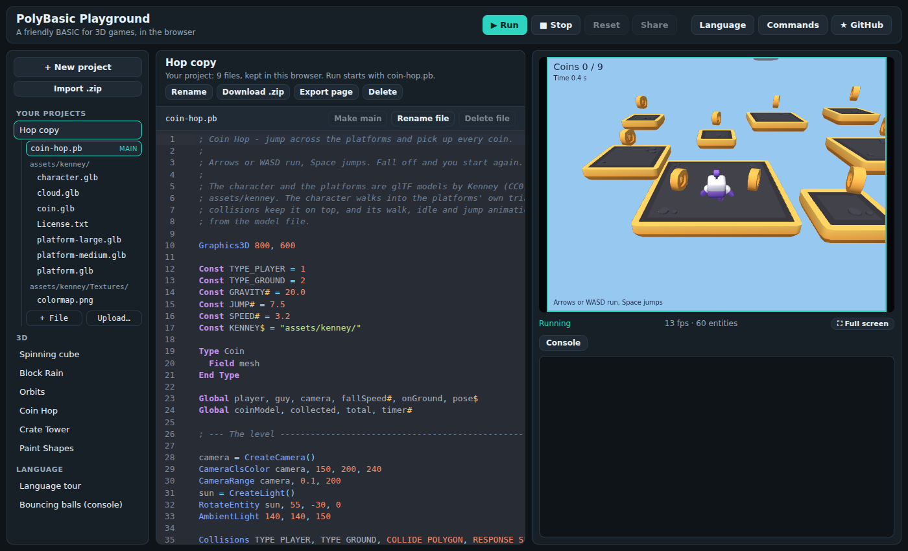
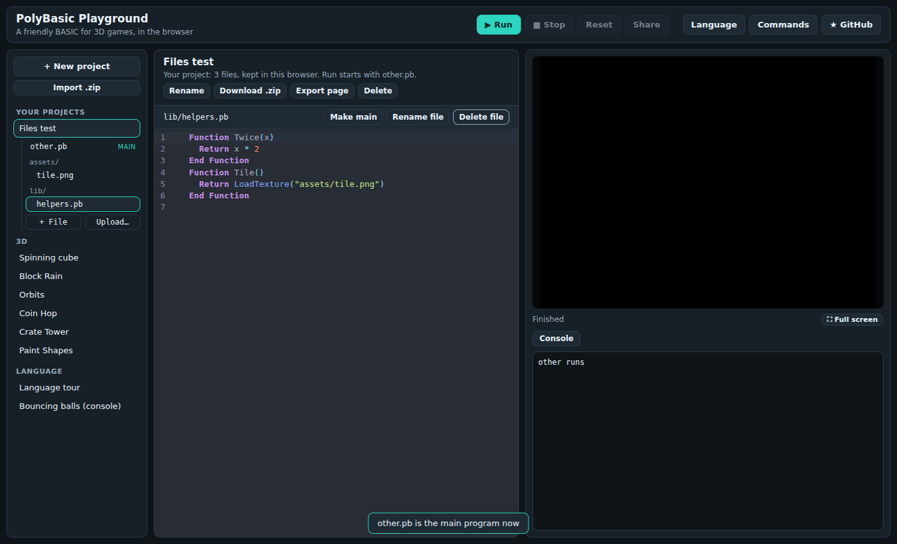
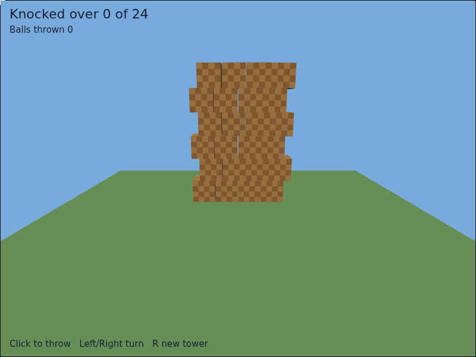

# The playground

The playground (`web/index.html`) is where PolyBasic programs are written
and run in the browser. It has two kinds of programs:

- **Examples**, listed under *3D* and *Language*. Edits to an example are
  kept in this browser (the list marks it *edited*); **Reset** goes back to
  the original, and **Share** copies a link that carries the code.
- **Your projects**, listed under *Your projects*. A project is a set of
  files (programs, images, models) with one **main** program, where Run
  starts.



## Projects

- **+ New project** starts a project with one file, `main.pb`.
- **Save as project** (on an example) copies the example and the files it
  uses (textures, models) into a new project, which then runs from its own
  files.
- **Rename**, **Delete** act on the open project.
- Typing saves the file being edited in the browser a moment later;
  Ctrl+S (Cmd+S) saves at once.

Projects are stored in the browser's IndexedDB, so they stay after the page
is closed, but only in this browser on this computer, and clearing the
site's data deletes them. Download a project as .zip to keep a copy. When
the browser does not allow the playground to store anything (some private
windows), the console says so and projects last until the page is closed.

## Files

The open project shows its files as a tree, with the main program first.

- **+ File** adds a file; a name with folders (`lib/enemies.pb`) makes
  them.
- **Upload…** adds files from the computer: `.pb` files go at the top of the
  project, everything else goes in `assets/`.
- **Make main**, **Rename file**, **Delete file** act on the open file. The
  main program cannot be deleted; make another file the main one first.
- Choosing an image, a model or a sound shows its size, a preview (images
  are shown, sounds can be played), and the line that loads it from the
  main program, such as `tex = LoadTexture("assets/tile.png")` or
  `sound = LoadSound("assets/jump.wav")`.

`Include "lib/game.pb"` adds another program file of the project; its
path is relative to the file that has the Include (see
[language.md](language.md#include)). Files loaded while the program runs
(`LoadTexture`, `LoadMesh`, `LoadSound`, `PlayMusic`...) are relative to
the main program, from whichever file the command is in: with `main.pb`
at the top, `LoadMesh("assets/ship.glb")` works in `main.pb` and in
`lib/game.pb` alike. A program in a project reads only the project's
files; a name that is not in the project is an error that names the file.

While typing, a compile error in another file of the project shows on
line 1 of the open file, with the file and line it is in. After Run, the
file with the error is opened at its line, and the console links to it.



## Out of the playground

- **Download .zip** saves the project as a .zip file: the files at their
  paths, and `polybasic.json` with the project's name and main program.
- **Import .zip** (in the sidebar) makes a new project from a .zip. Zips
  made by hand work too: a single folder around everything is taken off,
  system files (`__MACOSX`, `.DS_Store`, `Thumbs.db`) are left out, and
  without `polybasic.json` the main program is `main.pb`, or the only `.pb`
  file at the top, or the only `.pb` file.
- **Export page** saves the project as one .html file that plays it: the
  engine, the compiled program and every file of the project are inside the
  page, so it runs from any web server and when opened straight from the
  disk, with no other downloads. The physics engine is included only when
  the program uses physics commands. Without the project's own files the
  page is about 1.4 MB, or 4.2 MB with physics; the files add about a
  third more than their own size (they are stored as base64).



## Running it

The playground is a static site: serve the repository with any web server
and open `/web/`.

```
python3 -m http.server 8080
# then open http://localhost:8080/web/
```

`web/player.html?src=../examples/block-rain.pb` runs one program full page.
